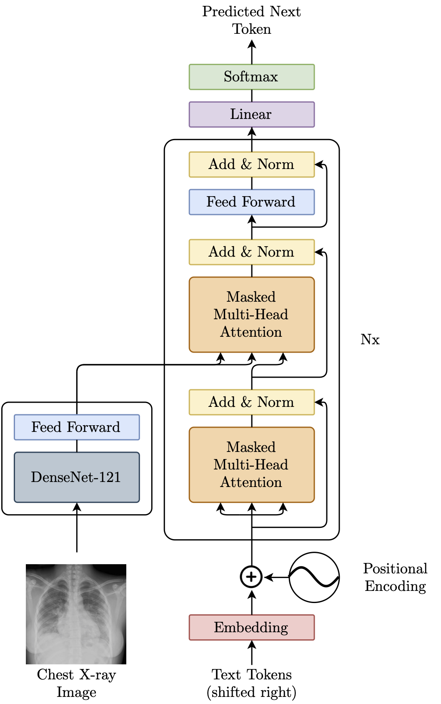
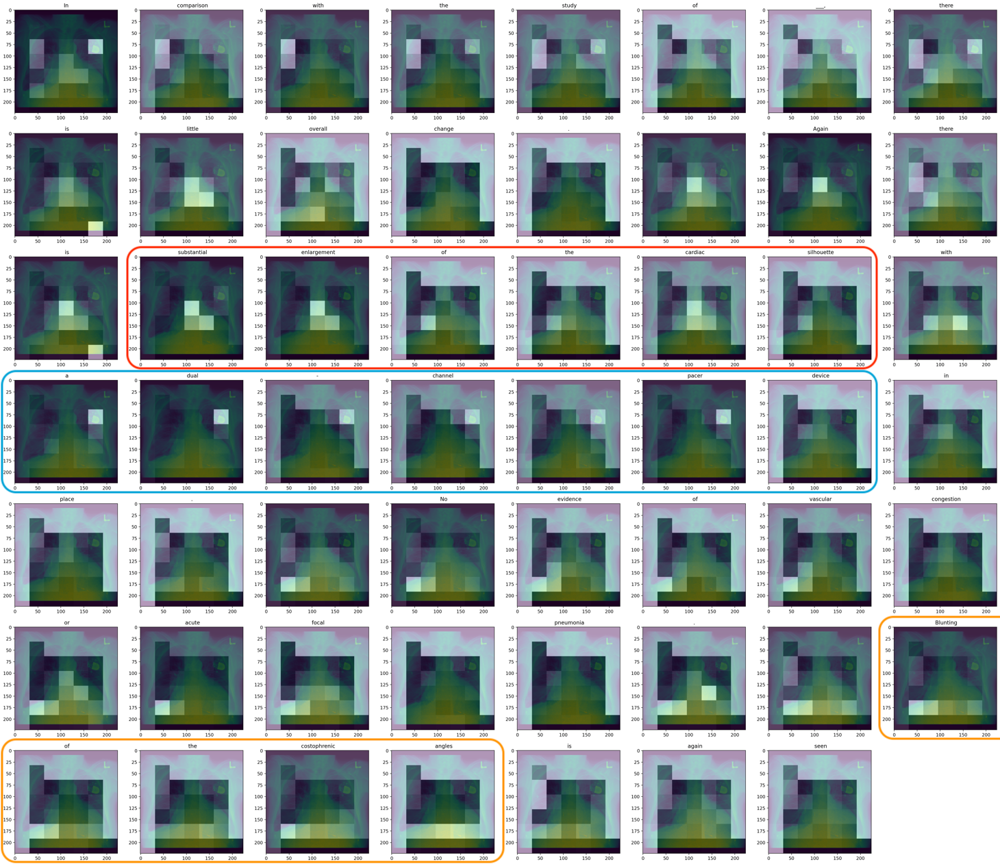
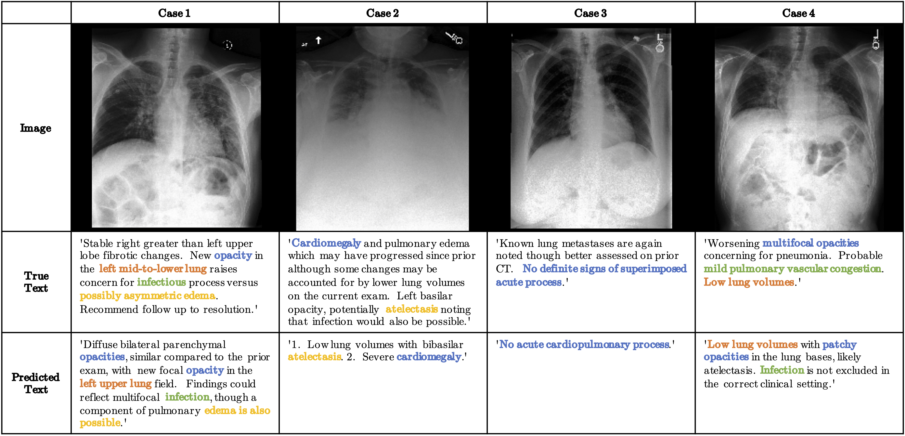

# RATCHET: RAdiological Text Captioning for Human Examined Thoraxes

RATCHET is a Medical Transformer for Chest X-ray Diagnosis and Reporting. Based on the architecture featured in [Attention Is All You Need](https://papers.nips.cc/paper/7181-attention-is-all-you-need.pdf). This network is trained and validated on the MIMIC-CXR v2.0.0 dataset.


### Architecture

<p align="center">
  
</p>


### Run the code

Download pretrained weights
([v1](http://www.doc.ic.ac.uk/~bh1511/ratchet_model_weights_202009251103.zip), 
[v2](http://www.doc.ic.ac.uk/~bh1511/ratchet_model_weights_202110181424.zip))
and put in `./checkpoints` folder. Then run:

```
streamlit run web_demo.py
```

##### Environment: 
```
Python 3.7.4
```

##### Packages:
```
imageio                  2.8.0
matplotlib               3.2.1
numpy                    1.18.4
pandas                   1.0.3
scikit-image             0.17.2
streamlit                0.67.1
tensorflow-gpu           2.3.0
tokenizers               0.7.0
tqdm                     4.46.0
```


### Docker Container

Build the docker container:

```
docker build -t ratchet ./Dockerfile
```

Run the docker image on CXR images:

```
docker run --user $(id -u):$(id -g) \
-v /path/to/image_input_folder:/code/RATCHET/inp_folder \
-v /path/to/report_output_folder:/code/RATCHET/out_folder:rw \
-i -t ratchet python run_model.py
```

Each image in `inp_folder` would have a corresponding `.txt` report saved in `out_folder`.


### Results

<p align="center">
  &nbsp;&nbsp;&nbsp;&nbsp;
  
  &nbsp;&nbsp;&nbsp;&nbsp;
  &nbsp;&nbsp;&nbsp;&nbsp;
  
  &nbsp;&nbsp;&nbsp;&nbsp;
</p>


##### Generated Text: 

> In comparison with the study of \_\_\_, there is little overall change. Again there is substantial enlargement of the cardiac silhouette with a dual-channel pacer device in place. No evidence of vascular congestion or acute focal pneumonia. Blunting of the costophrenic angles is again seen.


### More Examples

<p align="center">
  
</p>
