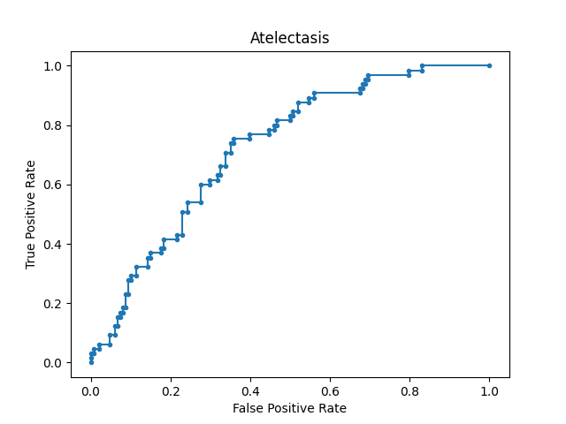
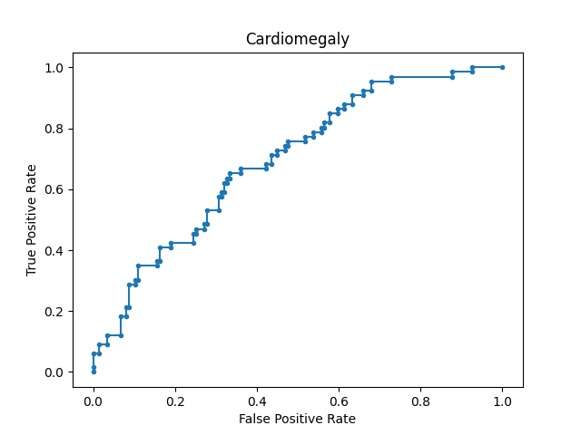
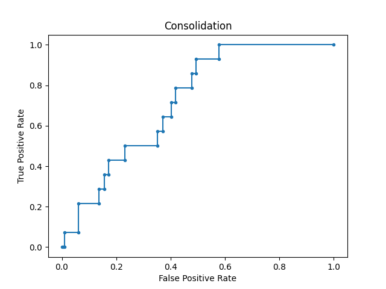
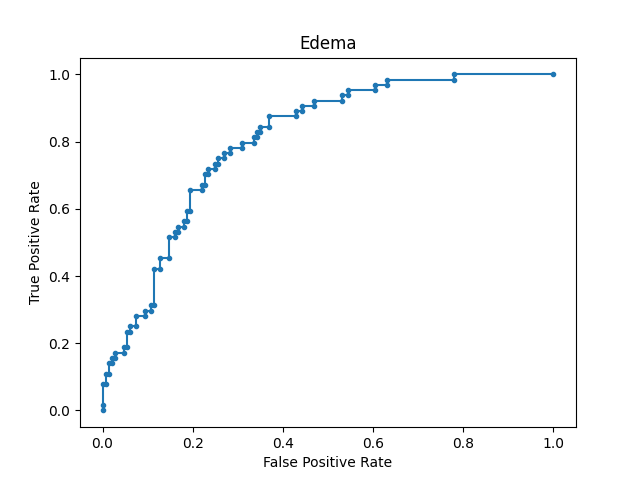
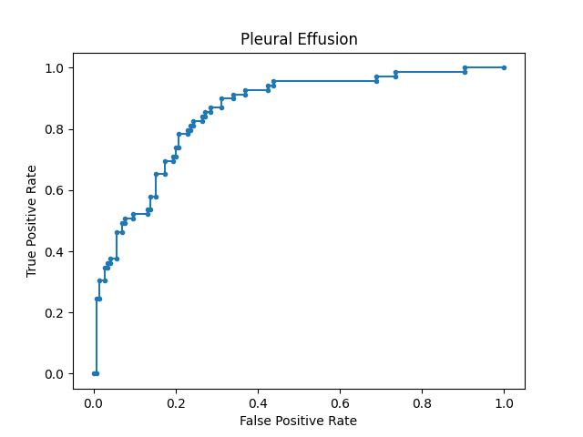

# Chest X-ray Classification with DenseNet-121 on MIMIC-CXR Dataset

This repository trains a Denset-121 architecture to a classifier with sigmoid activation function per class. 

The dataset used is MIMIC-CXR, data augmentation during training includes:

* `random_flip_left_right`
* `random_brightness`
* `random_saturation`
* `random_contrast`

## Files

```
.
├── README.md
├── assets
│   ├── roc_curves
│   │   ├── roc_curve_0.png
│   │   ├── roc_curve_1.png
│   │   ├── ...
│   │   └── roc_curve_13.png
│   ├── train.log
│   └── weights-improvement-09-0.32.hdf5
├── evaluate.py
└── train.py
```

- train.py: trains/validates with images from `MIMIC_AP_PA_{train|validate}.csv`
- evaluate.py: evaluates with images from uses images from `MIMIC_AP_PA_test.csv`
- train.log: output training log
- weights-improvement-09-0.32.hdf5: best saved snapshot 
- roc_curve_X.png: generated ROC Curves per class

## Results

|       | Classes/Metric      | AUC       | ACC       | Precision | Recall    | F1      |
| :---: | :---                | :---:     | :---:     | :---:     | :---:     | :---:   |
|       | No Finding          | 0.70434   | 0.78404   | 0.44444   | 0.48780   | 0.46512 |
|       | Enl. C. med.        | 0.65104   | 0.50704   | 0.13675   | 0.80000   | 0.23358 |
|  -->  | Cardiomegaly        | 0.71192   | 0.66197   | 0.46739   | 0.65152   | 0.54430 |
|       | Lung Lesion         | 0.75976   | 0.79812   | 0.11111   | 0.62500   | 0.18868 |
|       | Lung Opacity        | 0.64735   | 0.65728   | 0.52564   | 0.53247   | 0.52903 |
|  -->  | Edema               | 0.78450   | 0.70423   | 0.50467   | 0.84375   | 0.63158 |
|  -->  | Consolidation       | 0.68629   | 0.59155   | 0.10753   | 0.71429   | 0.18692 |
|       | Pneumonia           | 0.62936   | 0.64319   | 0.36145   | 0.56604   | 0.44118 |
|  -->  | Atelectasis         | 0.73597   | 0.65728   | 0.46491   | 0.81538   | 0.59218 |
|       | Pneumothorax        | 0.81538   | 0.63380   | 0.04938   | 0.80000   | 0.09302 |
|  -->  | Pleural Effusion    | 0.86574   | 0.82629   | 0.75000   | 0.69565   | 0.72180 |
|       | Pleural Other       | 0.78230   | 0.68545   | 0.04348   | 0.75000   | 0.08219 |
|       | Fracture            | 0.41270   | 0.30986   | 0.01351   | 0.66667   | 0.02649 |
|       | Support Devices     | 0.82396   | 0.76995   | 0.66250   | 0.70667   | 0.68387 |

N.B. `-->` == Classes used by CheXpert

Atelectasis                             |  Cardiomegaly                             |  Consolidation                            |  Edema                                    |  Pleural Effusion                          
:-------------------------:             |:-------------------------:                |:-------------------------:                |:-------------------------:                |:-------------------------:                
  |     |     |     |     
